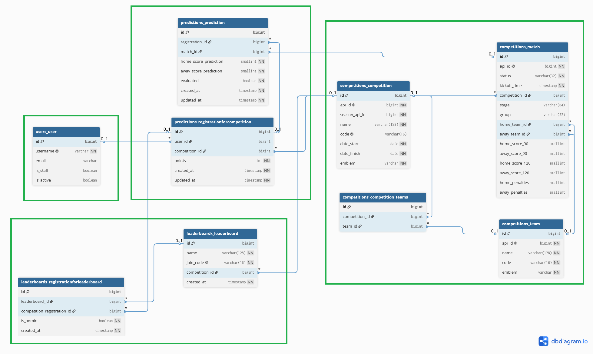

# Match Predictor

Match Predictor is an application that allows users to predict match outcomes and compete with each other in user-created leagues. By default, the application supports data synchronization for the 2026 FIFA World Cup

It is built with Django and fully containerized using Docker for easy deployment. The user interface is powered by Django Templates enhanced with HTMX to provide dynamic, asynchronous interactions.

## 1. Key Features

**User Features:**
* User authentication (registration, login, logout)
* Creating, joining, and managing leaderboards
* Predicting match outcomes within selected competitions

**System Features:**
* Fetching competition, team, and match data from an external API
* Updating match statuses and results
* Calculating and updating user points based on match outcomes


## 2. Project architecture
The project consists of several interconnected Django applications - 4 of them was made specificly for this project:

* **competitions**
* **predictions**
* **leaderboards**
* **users**

Each application maintains a strict, narrow scope of responsibility. The architecture of each app is based on the standard Django MVT (Model-View-Template) pattern, further enhanced by decoupling business logic from the views:
* **Services**: Handle database write operations and complex business logic.
* **Selectors**: Handle database read operations and query sets.

The application is built on an object-modeled relational database, expressed through model classes within individual apps.

Database schema generated from the models:



The application's user interface relies on standard Django HTML templates integrated with HTMX, allowing for partial page updates.

Database records can be fully managed through the built-in Django admin panel, while the authentication system relies on Django's native solutions.

## 3. Custom Django Commands

The application includes several custom management commands responsible for fetching and syncing data with the external API:

* **setup_competition --code [API_CODE]**

  Fetches and updates information about a specific competition, including the participating teams (e.g., --code WC for the World Cup).

* **fetch_matches --code [API_CODE]**

  Fetches and updates match data (fixtures and results) for the specified competition.

* **calculate_points --code [API_CODE]**

  Calculates and updates user points based on their match predictions within the specified competition.

* **run_scheduler --code [API_CODE]**

  Starts a continuous background process that updates match information every 30 minutes and subsequently recalculates user points for the given competition.


## 4. Covered test cases:

**Competitions app:**

 * Competition details selector
 * Leave competition service
 * Competitions matches sync service
 * Competitions setup service
 * Competitions list view
 * Competitions detail view

**Leaderboards app:**

 * Get leadearboard for member / admin selector
 * Join leaderboard service
 * Resign from leaderboard service
 * Remove member / admin from leaderboard service

**Predictions app:**
 * Join competition service
 * Calcualte points for a match service
 * Process predictions service
 * Evaluate prediction tests

## 5. Project configuration

  ### 5.1 .Env file
  Create a .env file in the root direcotry of the repository.
  Example:
  ```
  # Django
SECRET_KEY='key'
DEBUG=True

# Docker
DB_NAME=match-predictor
DB_USER=db_user
DB_PASSWORD=password
DB_PORT=5432
DB_HOST=db

# Footbal API:
FOOTBALL_DATA_API_KEY='key'
```

DB_HOST must match container db name in docker-compose.yml.

 ### 5.2 Build and start infrastructure
 ```
 docker compose up --build
 ```

 App is now available at: http://localhost:8000
 
 Admin panel is now avaialble at: http://localhost:8000/admin

## 6. Running app maintance

### 6.1 Initailize custom competition with proper Footbal API code eg. CL

```
docker compose exec web uv run python manage.py setup_competition --code CL
docker compose exec web uv run python manage.py fetch_matches --code CL
```

### 6.2 Upadte scores and users points for custom competition with proper Footbal API code eg. CL

```
docker compose exec web uv run python manage.py fetch_matches --code CL
docker compose exec web uv run python manage.py calculate_points --code CL
```

### 6.3 Clear database tables
```
docker compose exec web uv run python manage.py flush
```

### 6.4 Create superuser - to log into admin panel
```
docker compose exec web uv run python manage.py createsuperuser
```

## 7. Run tests


```
docker compose exec web uv run python manage.py test
```
